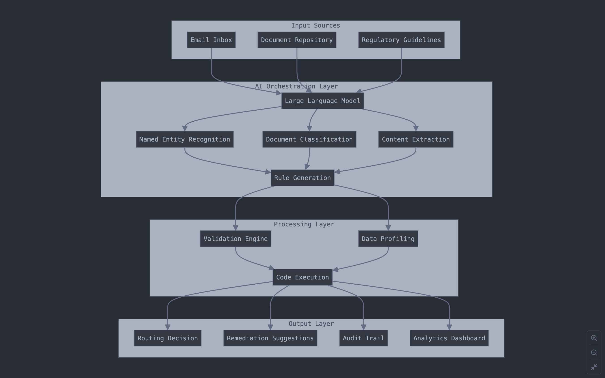

# AI-Based Data Profiling System for Document Triage/Routing

A comprehensive system that automates data profiling using generative AI and unsupervised machine learning.

## System Architecture

1. **Input Sources Layer** - Handles incoming emails, documents, and regulatory guidelines
2. **AI Orchestration Layer** - Processes inputs using LLMs and NLP techniques
3. **Processing Layer** - Performs validation and data profiling
4. **Output Layer** - Generates routing decisions, remediation suggestions, and auditing information

## Key Components

### 1. Regulatory Instruction Processor

- Loads various document formats (PDF, CSV, TXT)
- Uses text splitting and vector embeddings for efficient processing
- Extracts validation requirements including allowable values, required fields, and cross-field validations
- Refines and standardizes extracted requirements using LLMs

### 2. Rule Generator

- Creates rule templates from refined regulatory requirements
- Discovers additional rules through unsupervised learning on sample data
- Identifies patterns like statistical distributions, categorical values, and correlations
- Converts rules into executable validation code

### 3. Validation Code Generator

- Produces Python code that can run against any DataFrame
- Implements validation logic for range checks, categorical values, null checks, etc.
- Creates Great Expectations validation suites for standardized data validation
- Handles edge cases and provides detailed validation reports

### 4. Remediation Recommender

- Analyzes failed validations to identify root causes
- Provides step-by-step remediation instructions
- Determines which issues can be automated versus requiring manual review
- Generates audit-ready explanations for each remediation action
- Can apply automatic fixes for certain types of issues

### 5. Document Processor

- Processes emails and extracts attachments
- Classifies documents by type and content
- Extracts structured data elements from unstructured text
- Determines appropriate routing for documents
- Extracts validation requirements from regulatory documents

### 6. Main Orchestrator

- Manages the end-to-end workflow
- Processes regulatory documents to extract requirements
- Generates validation rules based on requirements and data samples
- Validates data against the rules
- Generates and applies remediation plans
- Creates comprehensive audit reports

### 7. Dashboard UI

- Displays key metrics on document processing, validation, and remediation
- Shows recent documents and their processing status
- Lists validation issues and their severity
- Provides detailed validation status reporting
- Shows remediation actions taken by the system

## Workflow Example

1. **Input**: The system receives regulatory documents and data files (CSV, Excel, etc.)
2. **Processing**:
   - The regulatory processor extracts validation requirements from documents
   - The rule generator creates validation rules based on these requirements
   - The validation code generator produces executable code for these rules
   - The data is validated against these rules
   - For any validation issues, the remediation recommender suggests fixes
   - Automatic fixes are applied where possible

3. **Output**:
   - Validated/remediated data
   - Comprehensive validation report
   - Audit trail of all actions taken
   - Dashboard visualization of the process

## Key Benefits

1. **Automation**: Reduces manual effort in data validation and profiling
2. **Accuracy**: Combines regulatory requirements with ML-discovered patterns
3. **Traceability**: Maintains complete audit trail for compliance
4. **Adaptability**: Can process various document types and data formats
5. **Intelligence**: Uses LLMs to understand context and nuance in documents
